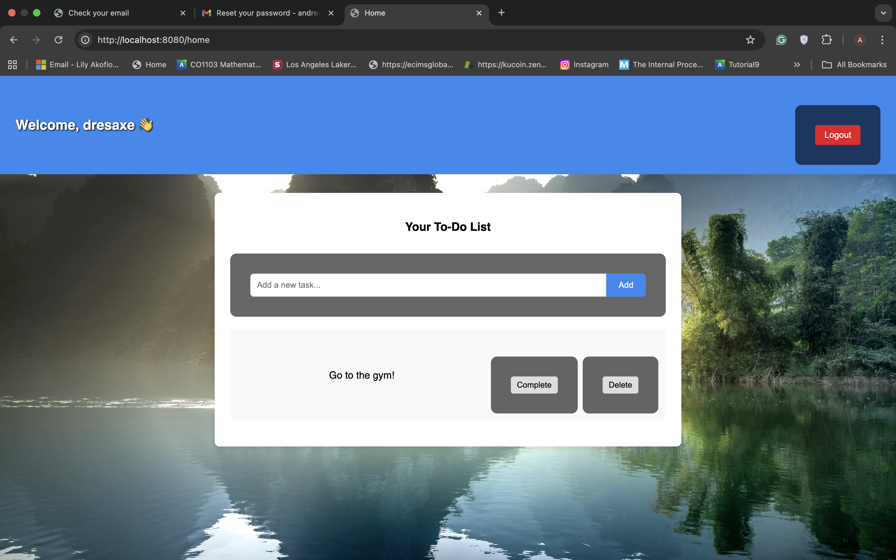

# 🔐 Secure Login System with 2FA (Spring Boot)

A production-style **secure authentication system** built with **Java Spring Boot**, **Spring Security**, and **MySQL**, featuring **Two-Factor Authentication (2FA)** and a full **password reset flow**.

# Secure Login System with 2FA (Spring Boot)

🎥 **Project Walkthrough Video Below (please click on it):** 


[](https://youtu.be/k7Ji9vuFQLY)

## 🚀 Features

-  User registration & login with **BCrypt password hashing**  
-  **Brute-force protection** with IP-based lockouts  
-  **Two-Factor Authentication (2FA)** using TOTP (Google Authenticator)  
-  QR code setup for 2FA during first login  
-  **Password reset via email** with expiring reset tokens  
-  CSRF protection & secure session handling  
-  Styled **Thymeleaf templates** (login, setup 2FA, verify 2FA, reset password)  
-  Built with **Spring Boot 3, Spring Security 6, Hibernate, MySQL**
-  To-Do List Dashboard after login (CRUD tasks: add, toggle, delete)

---

## 📸 Screenshots

### Registration Page


### Login Page


### 2FA Setup


### Dashboard


### Password Reset


---

## Tech Stack

- **Backend:** Java 19, Spring Boot, Spring Security  
- **Database:** MySQL + Hibernate (JPA)  
- **Frontend:** Thymeleaf templates + CSS  
- **Auth:** BCrypt password hashing, TOTP (RFC 6238)  
- **Mail:** Jakarta Mail (SMTP with Gmail)  

---

##  Setup & Run

### 1. Clone repo
```bash
git clone https://github.com/YOUR_USERNAME/secure-login-system-2fa.git
cd secure-login-system-2fa

```
### 2. Configure database

Create a MySQL DB and update application.properties:

```

spring.datasource.url=jdbc:mysql://localhost:3306/securelogin
spring.datasource.username=root
spring.datasource.password=yourpassword
```
3. Configure email (for password reset)
```

spring.mail.host=smtp.gmail.com
spring.mail.port=587
spring.mail.username=your_email@gmail.com
spring.mail.password=your_app_password
spring.mail.properties.mail.smtp.auth=true
spring.mail.properties.mail.smtp.starttls.enable=true
⚠️ Pls use an App Password if using Gmail (not your main password).
```
4. Run app
```

mvn spring-boot:run
App runs on: http://localhost:8080

 Demo User (optional)
For quick testing:

Username: demo
Password: demo123

How it works
Register → User is created with hashed password.

Login → On first login, redirected to /setup-2fa to scan QR.

2FA Verification → User enters 6-digit TOTP from Google Authenticator.

Password Reset → User requests reset → email sent with secure token link → new password set.

Security → Sessions rotate on login, CSRF protection, brute-force attempts limited.

```
## ✅ Dashboard (To-Do List)
--will add in GIF

🔒 Security Design

Passwords → hashed with BCrypt

2FA → Time-based One Time Passwords (RFC 6238)

Brute force defense → IP lockout after failed attempts

Session security → new session ID issued on login

Email verification → expiring reset tokens for password recovery

CSRF protection → enabled by Spring Security


🚀 Future Improvements

Dockerize the app for easier setup

Redis-based login attempt tracking

SMS / Email-based 2FA as alternatives

User profile management & roles


💡 Why this project?
This project demonstrates:

Applying security best practices in web applications.

Implementing multi-factor authentication (in-demand skill).

Designing real-world flows (password reset, brute force protection).

I built it to showcase my ability to design and implement secure authentication systems using Java and Spring Boot. This makes it a strong example of applying security best practices in a user-facing application.

📜 License
MIT License – free to use & adapt.
